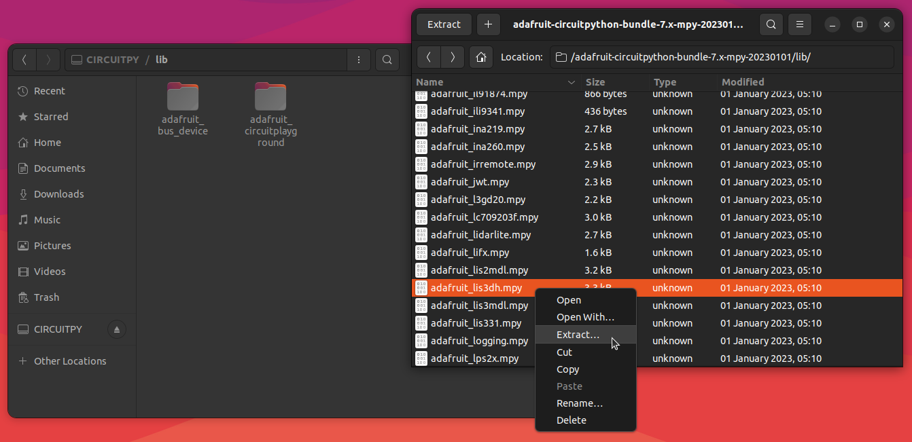
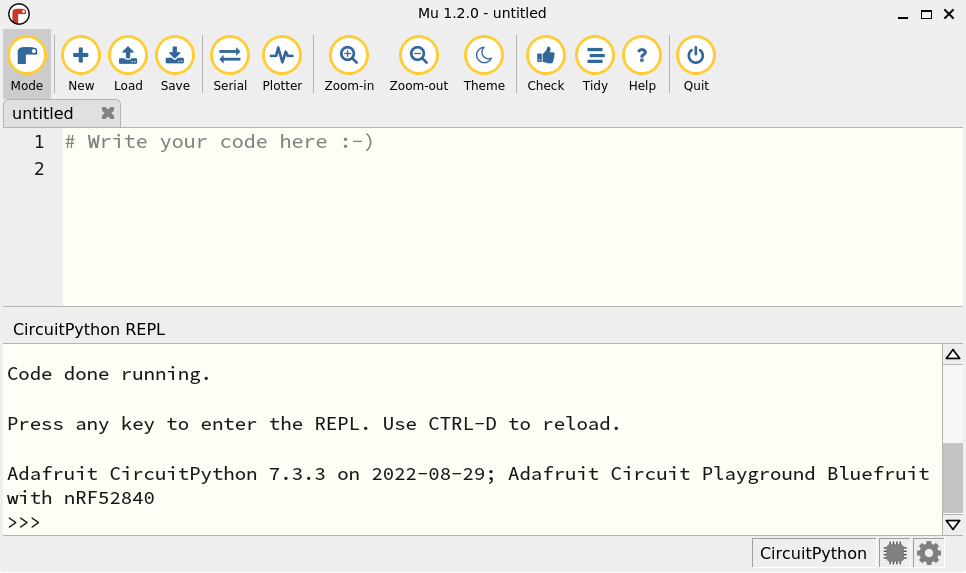

# circuitpython-projects

Learning Circuit Python and Adafruit Circuit Playground Bluefruit.

## Install Circuit Python

Plug the CircuitPlayground BlueFruit into the USB port on your computer.

Follow the directions in the following link to [install the CircuitPython and the AdaFruit apps for the Circuit Playground Bluefruit](https://learn.adafruit.com/adafruit-circuit-playground-bluefruit). The directions show how to [install the latest version of CircuitPython](https://learn.adafruit.com/adafruit-circuit-playground-bluefruit/circuitpython) on the Bluefruit board and then how to [install the Bluefruit Circuit Python Libraries](https://learn.adafruit.com/adafruit-circuit-playground-bluefruit/circuit-playground-bluefruit-circuitpython-libraries) on the board. 

### Choose libraries

Space on the Bluefruit is limited so just install the specific libraries you need for each project. For now, extract the minimum Adafruit Circuit Playground libraries, [as specified in the documentation](https://docs.circuitpython.org/projects/circuitplayground/en/latest/#installation), into the board's *CIRCUITPY/lib* folder

Install the following libraries:

* Folders:
  * adafruit_bus_device
  * adafruit_circuitplayground
* Files:
  * adafruit_thermistor.mpy
  * adafruit_neopixel.mpy
  * adafruit_lis3dh.mpy



For more information, read the [CircuitPython documentation](https://docs.circuitpython.org/en/latest/README.html) and the [CircuitPlayground BlueFruit library documentation](https://docs.circuitpython.org/projects/circuitplayground/en/latest/).

## Install the Mu Editor

Follow the directions in the following link to [download and install the Mu editor](https://learn.adafruit.com/welcome-to-circuitpython/installing-mu-editor). 

> **NOTE:** **Do not** use the *Ubuntu Software* application to install the Mu editor because the snap in Ubuntu's software store is out-of-date.

The Mu editor is available as an [AppImage](https://itsfoss.com/use-appimage-linux/). To install the Mu editor AppImage, first install the [AppImage Launcher](https://github.com/TheAssassin/AppImageLauncher#appimagelauncher) application.

```bash
sudo add-apt-repository ppa:appimagelauncher-team/stable
sudo apt update
sudo apt install appimagelauncher
```

Then, download the Mu Editor AppImage file from the [Mu website's downloads page](https://codewith.mu/en/download). Extract the AppImage file from the downloaded TAR archive. Then double-click on the AppImage file.

The AppImage Launcher automatically installs the application and integrates it with the Ubuntu launcher. Now, it shows up in a standard application search.

### Fix permissions

Finally, [set up permissions](https://learn.adafruit.com/adafruit-circuit-playground-express/connecting-to-the-serial-console#setting-permissions-on-linux-3027345) so you can access your computer's serial port from the Mu editor. Add your userid to the *dialout* permissions group.

```bash
sudo adduser $USER dialout
```

Also, [remove the modemmanager package](https://learn.adafruit.com/adafruit-circuit-playground-express/connecting-to-the-serial-console#serial-console-issues-or-delays-on-linux-3105120)  to prevent issues connecting to the serial port.

```
sudo apt purge modemmanager
```

Restart Ubuntu, or log out and back in to your user account. This will enable the change in permissions.

## Connect to the Bluefruit serial port

Start the [Mu editor](https://codewith.mu/) and click on the *Serial* button. You should see the [Serial Console](https://learn.adafruit.com/adafruit-circuit-playground-express/connecting-to-the-serial-console) appear in the Mu Editor's interface:



Now we can start testing the CircuitPlayground Bluefruit using the [CircuitPython REPL](https://learn.adafruit.com/welcome-to-circuitpython/the-repl). Click the *Return Key* in the Serial Console pane to start the REPL.

## Play with the LEDs

All ten Neopixels built into the Circuit Playground Bluefruit are turned off when the board is originally plugged in but they turn on when the REPL is running. They are very bright and you may want to turn them off when using the REPL. 

Turn off the ten NeoPixels around the CPB board by entering the following code into the REPL:

```python
>>> import board
>>> import neopixel
>>> pixels = neopixel.NeoPixel(board.NEOPIXEL, 10, auto_write=True)
```

The *pixels* object created by the *NeoPixel* class is a list of values representing the RGB values for each pixel. For example, list the current pixel values:

```python
>>> print(pixels)
[(0, 0, 0), (0, 0, 0), (0, 0, 0), (0, 0, 0), (0, 0, 0), (0, 0, 0), (0, 0, 0), (0, 0, 0), (0, 0, 0), (0, 0, 0)]
```

When you  the values, you cause the board to light up the pixels using the values in the list. The *pixels.show* function forces the board to read the values in the *pixels* list and update the NeoPixels. Since the *pixels* list defaults to all zero values, this turns the NeoPixels off. 

```python
>>> pixels.show()
```

The *pixels.show* function is most useful if you set value of the *auto_write* parameter to *False* when you create the pixels object. In that case, the board will let you change the value of multiple NeoPixels but will not change the NeoPixels until you run the *pixels.show()* function. 

You can decide for yourself if you want all the pixels to update every time you change any pixel value, or if you want to trigger an update separately with the *show* function by choosing whether the value of the *pixels* object's *auto_write* parameter is *True* or *False*.

After executing the statements shown above, each of the Bluefruit board's ten Neopixels can be addressed by the *pixels* list index. 

For example, the first NeoPixel is addressed by the list index *0*. For example: `pixels[0]`. To demonstrate this, make the first NeoPixel blink different colors by executing the following statements in the REPL:

```python
>>> import time
>>> while True:
...     pixels[0] = (0,0,1)
...     time.sleep(1)
...     pixels[0] = (0,1,0)
...     time.sleep(1)
...     pixels[0] = (1,0,0)
...     time.sleep(1)
```

See that the first NeoPixel blinks blue, green, then red, and repeats every second.

Stop the loop by entering *CTRL-C* in the serial console.

### Sleep statement and serial console

The sleep statement is **required** in the While loop if you are monitoring output to the serial console. 

If you omit the sleep statement, the board runs through the code too fast and print statements in the loop will overload the Mu editor's serial console. Then, the Mu editor seems to get hung up and stops accepting inputs from the keyboard. Even if you restart the board to stop the loop, the Mu editor will no longer accept inputs from the keyboard. 

To solve this issue, close the Mu editor and start it again.

### Other LEDs

Other LEDs are available on the board. Turn the CircuitPlayground BlueFruit board's red LED on, then off, execute the following statements:

```python
>>> import adafruit_circuitplayground
>>> adafruit_circuitplayground.bluefruit.cpb.red_led = True
```

See that the red LED is on. Then:

```python
>>> import adafruit_circuitplayground
>>> adafruit_circuitplayground.bluefruit.cpb.red_led = False
```

See that the red LED is off.


